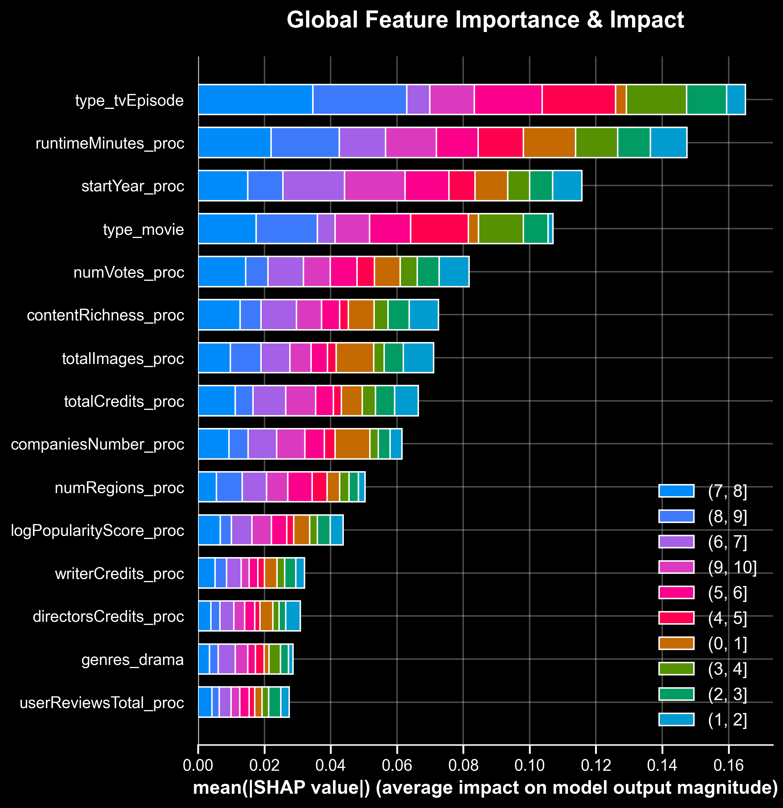
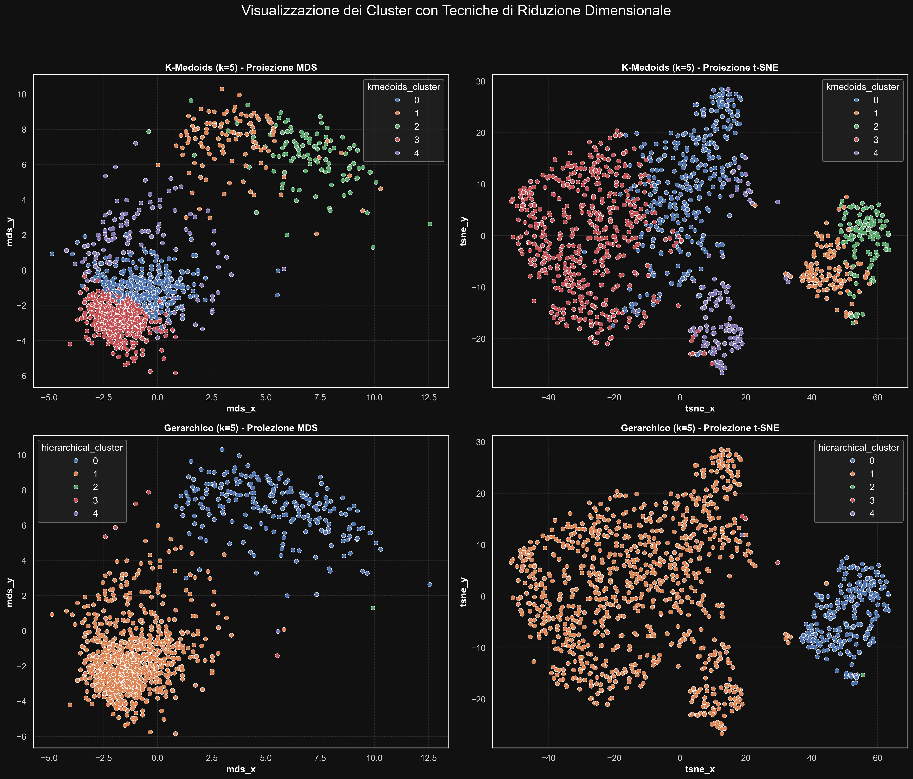
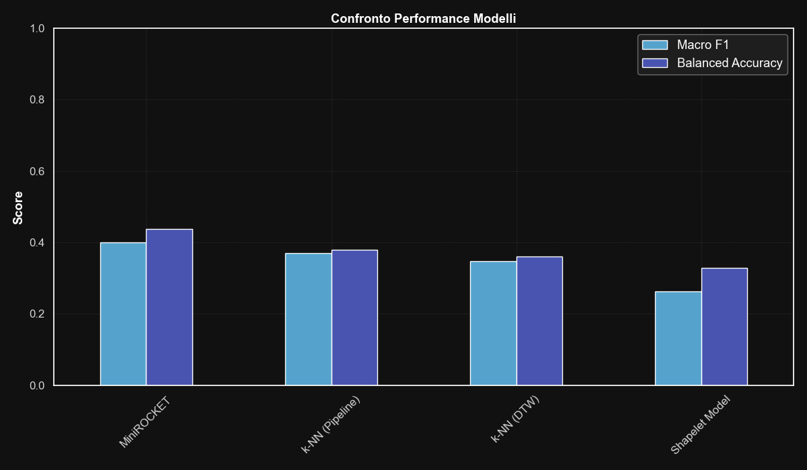

**Author:** Giuseppe Muschetta  
**University:** University of Pisa  
**Degree:** M.Sc. in Data Science & Business Informatics  
**Course:** Data Mining 2 — Advanced Data Mining  
**Academic year:** 2025-2026

---

# Advanced Data Mining: Explainable AI & Time Series

### From IMDb Metadata to Interpretable Predictions and Box-Office Dynamics

**149,531 IMDb records · 1,134 film revenue trajectories · 9 analytical notebooks**

[Read the technical report](Report/Report.pdf) · [Explore the notebooks](#explore-the-notebooks) · [See the selected figures](#selected-figures)

---

How much can metadata explain about a film's reception? What changes when the target class is rare? Can the shape of a box-office trajectory reveal a film's commercial lifecycle—and help predict its rating?

This project brings those questions into one **advanced Data Science investigation**, connecting robust feature engineering, consensus anomaly detection, imbalanced learning, ensemble methods, neural networks, **SHAP explainability**, and **time-series mining**. It studies both the static characteristics of audiovisual titles and the temporal dynamics of their daily revenues.

Developed by **Giuseppe Muschetta** for the **master's-level examination in Data Mining**, as part of the **M.Sc. in Data Science & Business Informatics at the University of Pisa**, this work documents the reasoning behind each modeling choice through nine notebooks and a **32-page technical report**. Its defining thread is the connection between **prediction, interpretation, and the structure of the data**.

## Project highlights

| Dimension | Contribution |
|:---|:---|
| **Tabular modeling at scale** | Starts from 149,531 IMDb records and 32 original attributes; the cleaned modeling dataset contains **148,432 titles**. |
| **Robust numerical preparation** | Combines multivariate imputation, domain-informed features, and **RobustScaler → Yeo–Johnson → StandardScaler** transformations. |
| **Consensus anomaly detection** | Compares Isolation Forest, LOF, and CBLOF, selecting **1,089 observations** flagged by at least two detectors. |
| **Learning under severe imbalance** | Studies documentary detection at a **96:4 class ratio**, comparing the original distribution, SMOTE, and random undersampling. |
| **Explainable predictive models** | Investigates ten-class rating prediction with linear models, tree ensembles, and a regularized neural network, then explains Random Forest decisions with **SHAP**. |
| **Continuous rating prediction** | Tuned AdaBoost achieves **RMSE = 0.8825** and **R² = 0.5682** on the original 1–10 rating scale. |
| **Temporal pattern discovery** | Studies **100 daily observations per film**, with DTW clustering, matrix profiles, and learned shapelets. |
| **Time-series model comparison** | **MiniROCKET + Ridge** leads the recorded four-class comparison with **macro F1 = 0.4006** and **balanced accuracy = 0.4384**. |

*Numerical results are drawn from the original report and saved notebook outputs. Each metric belongs to its stated task and experimental configuration.*

## Two data domains, one analytical investigation

The project develops two complementary branches:

- **IMDb metadata:** audience ratings, engagement, production credits, awards, runtime, title type, genres, countries, regions, and sound mixes. After preparation and consensus outlier filtering, the supervised models use **85 predictors**.
- **Daily box-office time series:** **1,134 films × 100 days**, accompanied by ratings and genre metadata. The analysis explores revenue magnitude, relative revenue allocation, trajectory shape, and recurring temporal patterns.

These branches support different questions: what predicts a title's reception, what explains a model's decision, and how a film's commercial behavior evolves over time.

## Robust preparation and consensus anomaly detection

The tabular preparation begins with statistical exploration of numerical and categorical variables, supported by **Pearson and Spearman correlations** and **Cramér's V**. It removes duplicate records and redundant attributes, parses IMDb placeholders and list-like fields, and constructs numerical representations of title types and multi-label metadata.

Missing runtimes are estimated with **IterativeImputer**, using numerical metadata and title-type indicators. Five engineered features capture additional aspects of a title:

| Feature | Interpretation |
|:---|:---|
| `winRate` | Award wins relative to wins plus nominations. |
| `contentRichness` | A composite of quotes, videos, images, and production credits. |
| `logPopularityScore` | Log-scaled interaction between vote counts and review volume. |
| `criticUserRatio` | The relative volume of critic and user reviews. |
| `hasWriterAndDirector` | Whether both writer and director credits are available. |

A three-stage numerical pipeline handles scale disparities and skewness: **robust scaling, Yeo–Johnson transformation, and standardization**. Original values are retained alongside transformed columns for later interpretation.

Outlier detection then compares three complementary definitions of unusual behavior:

- **Isolation Forest:** ease of isolation through random partitions.
- **Local Outlier Factor:** deviation from the density of nearby observations.
- **Cluster-Based Local Outlier Factor:** unusual position relative to the cluster structure.

Each detector uses 1% contamination. A **two-out-of-three consensus** selects 1,089 observations, approximately **0.73%** of the prepared dataset. PCA views and title-level profiles help interpret their characteristics before the cleaned data is used in subsequent modules.

## Imbalanced learning: the precision–recall trade-off

The documentary-detection experiment deliberately constructs a **96% non-documentary / 4% documentary** dataset. Keeping the same Decision Tree configuration across experiments makes the effect of resampling visible.

| Training strategy | Documentary precision | Documentary recall | Documentary F1 |
|:---|---:|---:|---:|
| Imbalanced baseline | **0.57** | 0.18 | 0.27 |
| SMOTE | 0.22 | 0.87 | **0.36** |
| Random undersampling | 0.18 | **0.88** | 0.30 |

*Minority-class results reported in Table 5 of the [technical report](Report/Report.pdf). Resampling is applied to the training partition.*

SMOTE substantially increases the proportion of documentaries found and achieves the highest minority-class F1 in this comparison. The accompanying precision–recall analysis makes the cost of that improvement explicit: more minority detections also bring more false positives. Feature-importance comparisons examine how the different training distributions alter the model's reliance on metadata.

## Advanced classification and explainable AI

The tabular classification task retains **all ten original IMDb rating intervals**, from `(0, 1]` to `(9, 10]`. This preserves a demanding ordinal structure with rare extreme classes and closely related neighboring ratings.

The implemented model families include:

- **Logistic Regression** and **calibrated LinearSVC** for linear decision boundaries and probability-based evaluation.
- **Random Forest** and **XGBoost** for nonlinear feature interactions.
- A **weighted Softmax neural network**, with 256–128–64 hidden units, batch normalization, Gaussian noise, L2 regularization, dropout, and training callbacks.

Cross-validation guides hyperparameter searches; confusion matrices, per-class reports, ROC curves, and precision–recall curves document the resulting behavior.

| Model | Macro F1 reported in the technical report |
|:---|---:|
| Random Forest | **0.37** |
| XGBoost | 0.36 |
| Weighted Softmax neural network | 0.18 |
| Logistic Regression | 0.15 |
| Calibrated LinearSVC | 0.14 |

*Table 9 of the [technical report](Report/Report.pdf). These are the report's classification results; the notebooks also retain outputs from their recorded configurations.*

### Explaining the forest

The SHAP analysis connects ensemble prediction to readable feature contributions at three levels:

1. **Global:** class-specific feature importance across the ten rating intervals.
2. **Local:** waterfall plots showing how individual features contribute to a class output.
3. **Across instances:** decision plots comparing how feature contributions accumulate for different titles.

*Mean absolute SHAP contributions highlight title type, runtime, release year, and vote count. Colors distinguish the ten rating classes.*

This makes the model's use of content type, temporal metadata, and engagement visible. The explanations describe **model behavior**, giving the predictive results a concrete analytical interpretation.

## Advanced regression on the original rating scale

The regression branch predicts continuous **`averageRating`**, comparing bagging through Random Forest with boosting through AdaBoost. Five-fold cross-validation optimizes negative RMSE; residual diagnostics and feature importances support the comparison.

| Regressor | MAE | RMSE | R² |
|:---|---:|---:|---:|
| AdaBoost | **0.6115** | **0.8825** | **0.5682** |
| Random Forest | 0.6230 | 0.8921 | 0.5588 |

*Results reported in Table 11 of the [technical report](Report/Report.pdf). Errors are expressed in rating points on the original 1–10 scale.*

AdaBoost records the lowest errors in this experiment, with Random Forest close behind. The Random Forest's **out-of-bag R² of 0.5632** also sits near its reported test R² of 0.5588, providing an additional internal estimate for the comparison.

## Mining the temporal lifecycle of films

The time-series branch analyzes **113,400 daily revenue observations** over fixed 100-day windows. It explores raw revenues, logarithmic values, per-film percentages, per-film standardization, min–max scaling, and global standardization.

Fourteen engineered revenue features describe opening performance, early revenue concentration, peak timing, late revenue share, and volatility. These give the trajectory-level analysis an interpretable economic context.

### DTW clustering and commercial archetypes

Per-film standardization emphasizes trajectory shape. **Dynamic Time Warping** provides a pairwise dissimilarity matrix that allows temporal alignment, used by **K-Medoids/PAM** and average-linkage hierarchical clustering.

Silhouette analysis explores cluster counts from 2 to 20. The study selects **five K-Medoids groups** to obtain a useful level of interpretive detail. Actual medoid films, DTW barycenter profiles, and metadata summaries support the characterization of the groups.

The report interprets them as five commercial lifecycle archetypes: **front-loaded blockbusters, high-variance performers, sustained successes, long-tail performers, and slow-burn niche successes**.

*MDS and t-SNE provide complementary views of the same DTW-based partitions. The comparison makes the different grouping behavior of the two clustering methods visible.*

### Motifs, discords, and shapelets

The temporal exploration also uses **STUMP matrix profiles** to search for recurring 15-day subsequences and investigate unusual patterns. Standardized film series are concatenated with separators to keep subsequences within their source film.

A separate learned-shapelet experiment investigates the relationship between recurring patterns and Action/Drama genre membership. Together, these methods connect three useful perspectives on temporal data: **recurrence, unusual behavior, and supervised subsequence learning**.

## Comparing time-series classifiers

The classification task predicts four rating categories from each film's 100-day revenue trajectory. After excluding the sparsely populated `Low` category, it uses **1,124 films**, with **899 training examples and 225 test examples**.

The comparison spans distance-based methods, learned subsequences, and convolutional feature extraction:

| Model | Test macro F1 | Test balanced accuracy |
|:---|---:|---:|
| **MiniROCKET + class-balanced Ridge** | **0.4006** | **0.4384** |
| KNN pipeline, Euclidean distance | 0.3702 | 0.3786 |
| KNN with DTW | 0.3466 | 0.3600 |
| Learned-shapelet model | 0.2626 | 0.3278 |

*Recorded comparison in the time-series classification notebook and Table 18 of the [technical report](Report/Report.pdf).*

**MiniROCKET achieves the highest macro F1 and balanced accuracy in this experiment**, with a recorded pipeline fit time of approximately **0.48 seconds**. The comparison includes confusion matrices, class-level metrics, and timing observations, making the trade-offs between model families explicit.

## Explore the notebooks

| Notebook | Analytical focus |
|:---|:---|
| [Tabular data understanding](module_0_data_understanding.ipynb) | Statistical exploration, parsing, imputation, feature engineering, and robust transformations. |
| [Time-series data understanding](module_0_time_series_data_understanding.ipynb) | Daily revenue dynamics, normalization choices, and interpretable temporal features. |
| [Outlier detection](module_1_outliers.ipynb) | Isolation Forest, LOF, CBLOF, consensus filtering, and PCA interpretation. |
| [Imbalanced learning](module_1_imbalanced_learning.ipynb) | Documentary detection, SMOTE, undersampling, and minority-class evaluation. |
| [Advanced classification and XAI](module_2_advanced_classification_xai.ipynb) | Ten-class rating prediction, ensembles, neural modeling, and SHAP explanations. |
| [Advanced regression](module_2_advanced_regression.ipynb) | Random Forest and AdaBoost rating prediction, diagnostics, and feature importance. |
| [Motifs and discords](module_3_motifs_discords.ipynb) | Matrix profiles, recurring subsequences, anomaly exploration, and learned shapelets. |
| [Time-series clustering](module_3_ts_clustering.ipynb) | DTW, K-Medoids, hierarchical comparison, embeddings, and film profiles. |
| [Time-series classification](module_3_ts_classification.ipynb) | KNN, DTW, shapelets, MiniROCKET, and comparative evaluation. |

**Technical stack:** Python, Jupyter, pandas, NumPy, SciPy, scikit-learn, imbalanced-learn, PyOD, XGBoost, TensorFlow/Keras, SHAP, tslearn, STUMPY, sktime, scikit-learn-extra, Matplotlib, and Seaborn.

## Selected figures

The README uses three original figures:

| Figure | Repository path |
|:---|:---|
| Global SHAP importance | [01_global_beeswarm.png](plots_advanced_classification_xai/random_forest_explainability/01_global_beeswarm.png) |
| DTW clustering comparison | [clusters_visualization.png](plots_time_series_clustering/clusters_visualization.png) |
| Time-series classifier comparison | [model_comparison.png](plots_time_series_classification/model_comparison.png) |

These complement the full set of analytical results documented in the notebooks and [technical report](Report/Report.pdf).

## Data availability

The source datasets are **not included** in this repository. The original notebooks reference local inputs and intermediate tables such as `Dataset/imdb.csv`, `Dataset/imdb_prepared.csv`, `dataset/imdb_prepared_no_outliers.csv`, and `TS_Dataset/imdb_ts.csv`. Their preparation and use are documented in the notebooks.

Saved notebook outputs, the selected figures, and the technical report provide the experimental narrative and reported results.

## License

The project code and documentation are released under the [MIT License](LICENSE.md).
